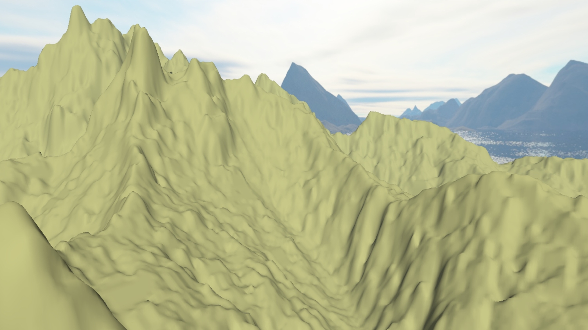
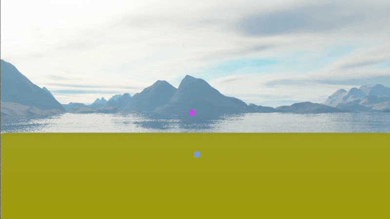
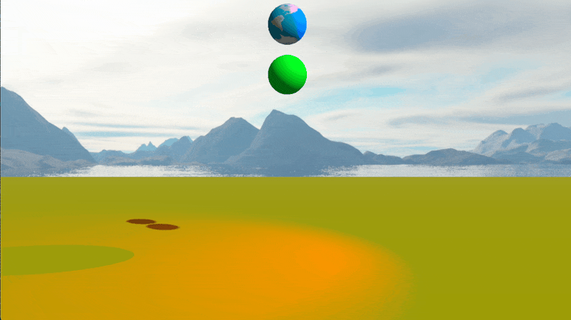

# 3D graphics and physics engine

A simple engine for 3-dimensional games and physics simulations written from
scratch in C++.
The graphics are rendered using OpenGL, by means of the open source library GLFW.

## List of features

Some of the features of the engine are showcased in the [Gallery](#gallery) below.

### Graphics

- Deferred rendering
    - The properties of each object are given by its material, which specifies
    the albedo color, specular and emissive intensities.
    - Also possible to add textures for the albedo color.
- Different light sources
    - Directional lights
    - Point lights
    - Spot lights
- Cascaded shadow maps
- Fog effect added in postprocessing
- Text and simple GUI rendering to the screen
- Drawing terrain from a heightmap using tessellation shaders

### Physics engine

- Ballistic movement of objects
- Particle systems
- Force generators
    - Gravity
    - Drag
    - Spring-like forces (in the center of mass)

## Examples

- Sandbox [link](examples/Sandbox)

## Gallery

- Terrain created from a heightmap texture, drawn with a tessellation shader.

- Particle system.

- Spheres connected by a spring-like force and a spotlight with shadows.

## References

- [Learn OpenGL](https://learnopengl.com/)
- "Game Physics Engine Development" by Ian Millington
